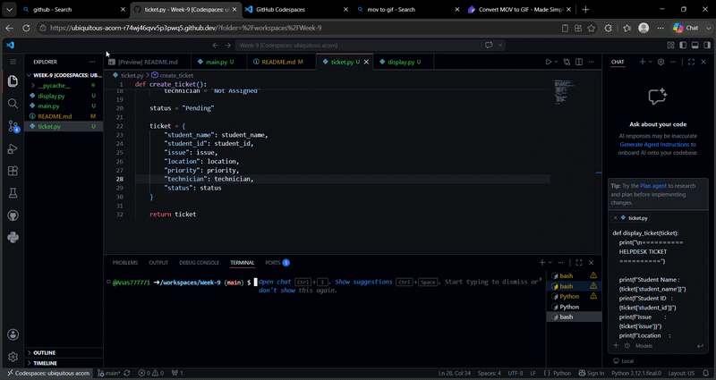

# Helpdesk Ticket System

## Purpose

This project is a simple Helpdesk Ticket System developed using Python.

It allows students to submit IT support requests by entering their information. The system automatically assigns a technician according to the priority level.

## Features

- Enter student information
- Enter issue description
- Select ticket priority
- Automatically assign technician
- Display the completed helpdesk ticket

---

## Technologies Used

- Python 3
- Visual Studio Code
- GitHub

---

## How to Run

1. Open the project in VS Code.
2. Run `main.py`.
3. Enter the required information.
4. View the generated ticket.

---

## Example

Student Name: Ali

Student ID: 22012345

Issue: Computer cannot connect to WiFi

Location: Lab 2

Priority: High

Technician: Ahmad

Status: Pending

